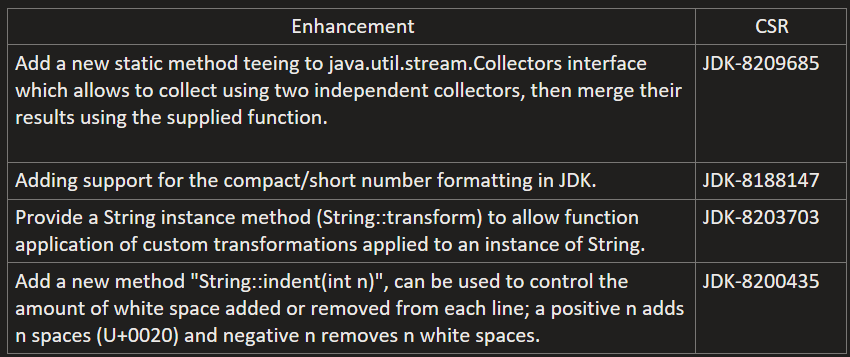
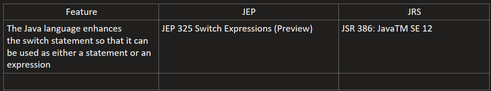

# java-12-features
## New Enhancements

## New Preview Features

## Configurations to use "Preview" features in Java 12
Settings > Build, Execution, Deployment > Compiler > Java Compiler :

-- Project bytecode version: 12

-- Per-module bytecode version:
- Module: java-12-features
- Target bytecode version: 12

Run/Debug Configurations > Application > [Choose Application] :

-- Build and Run > Modify Options > Add VM Options : --enable-preview
